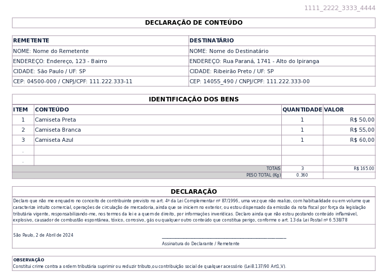

# Declaração de Conteúdo - Correios 





__Instalação__

- Python 3.10+
- ```pip install -r requirements```


__Executando__

- Configure os diretorios de `input`, `output` e `template` no arquivo `.env`
- Configure os dados do remetente no arquivo: `INPUT_DIR/remetente/remetente.json`
- Exporte o arquivo com os dados da venda no formato `.csv` para dentro do diretorio `INPUT_DIR`
- Execute: `python main.py` dentro do diretorio `src`
- A saída será um arquivo `.pdf` gerado no diretorio `OUTPUT_DIR` para cada registro encontrado no arquivo de entrada.


